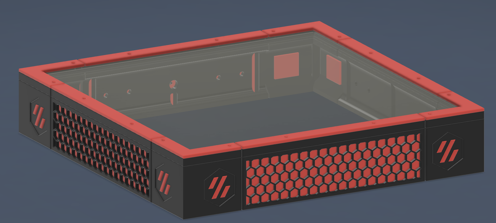

## Parts required for Top-Hat Only:

### Hardware:

    -32 Standard Voron Heatsets
    -16 m3x8  BHCS Screws
    -16 m3x12 BHCS Screws
    -1 ECAS04
    
### Printed Parts:
  
    -Top-Hat Side x3
    -Top-Hat Back x1
    -Top-Hat Corner x4
    -Top-Hat Panel Inset x4
    -Top-Hat Corner Panel Inset x4
    -Top-Hat Panel Clamp x4
    -Top-Hat and PSU Corner Panel Clamp x4
    -Accent x8

## Parts required for Top-Hat and PSU Bay:

### Hardware:
  
    -68 Standard Voron Heatsets
    -16 m3x8  BHCS Screws
    -36 m3x12 BHCS Screws
    -2 PG9 Cable Glands
    -2-4 4010 Axial Fans
    -1 ECAS04
    
### Printed Parts:
  
    -Top-Hat Side x3
    -Top-Hat Back x1
    -Top-Hat Corner x4
    -Top-Hat Panel Inset x4
    -Top-Hat Corner Panel Inset x4
    -PSU Front x1
    -PSU Back x1
    -PSU Fan Side x2
    -PSU Corner x4
    -PSU Panel Inset x4
    -PSU Corner Panel Inset x4
    -PSU Panel Clamp x4
    -Top-Hat and PSU Corner Panel Clamp x4
    -Accent x16
    
